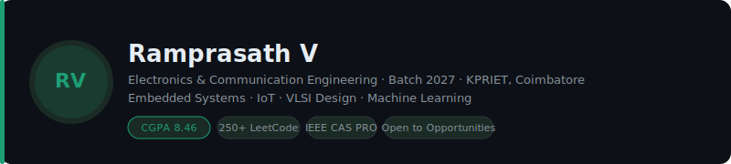
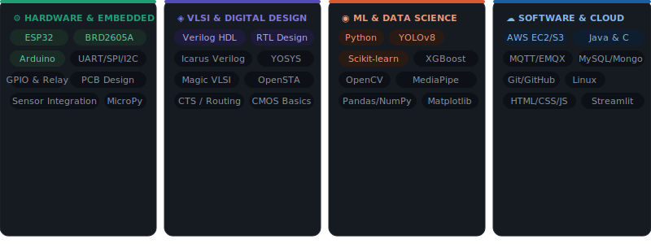
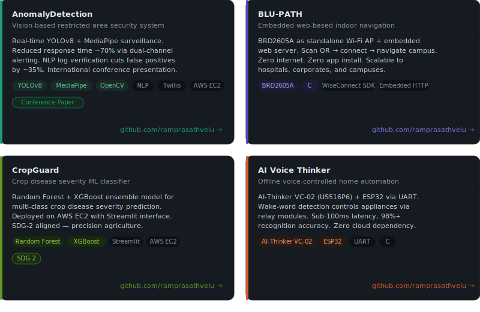
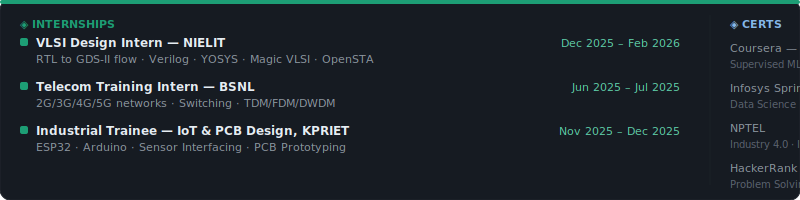

 

## 🎯 About me

Final-year Electronics and Communication Engineering student with strong skills in embedded systems, industrial IoT,
and AI-based real-time systems. Experienced in sensor integration, microcontrollers, MQTT communication, and
computer vision for automation and anomaly detection. Focused on building efficient, intelligent solutions for real-world
industrial challenges. Aiming to contribute to smarter, sustainable systems aligned with Industry 4.0.

 

## 🛠️ Skills

 

## 🚀 Featured projects

| Project | Stack | Links |
|---|---|---|
| **AnomalyDetection** — Vision-based restricted area security | YOLOv8 · MediaPipe · NLP · AWS | [Repo ↗](https://github.com/ramprasathvelu/AnomalyDetection) |
| **BLU-PATH** — Embedded web-based indoor navigation | BRD2605A · C · WiseConnect · HTML | [Repo ↗](https://github.com/ramprasathvelu/BLU-PATH-Embedded-Web-Based-Indoor-Navigation-System) |
| **CropGuard** — Crop disease severity classifier | Random Forest · XGBoost · Streamlit · AWS | [Repo ↗](https://github.com/ramprasathvelu/CropGuard) |
| **AI Voice Thinker** — Offline voice home automation | VC-02 · ESP32 · UART · C | [Repo ↗](https://github.com/ramprasathvelu/AI-Voice-Thinker) |

 

## 💼 Experience & certifications

 

## 🎓 Education

| Degree | Institution | Period | Score |
|---|---|---|---|
| B.E. Electronics & Communication Engineering | KPRIET, Coimbatore | 2023 – 2027 | CGPA 8.46 |
| Higher Secondary Certificate (HSC) | Bharathi Matric Hr. Sec. School, Kallakurichi | 2022 – 2023 | 88.89% |

 

## 🏅 Activities

- **Public Relations Officer** — IEEE Circuits and Systems Society (CAS), KPRIET

 

  <a href="mailto:veluramprasath777@gmail.com">📧 veluramprasath777@gmail.com</a> &nbsp;·&nbsp;
  <a href="https://linkedin.com/in/ramprasath-v">LinkedIn</a> &nbsp;·&nbsp;
  <a href="tel:+919360878206">+91 93608 78206</a>

